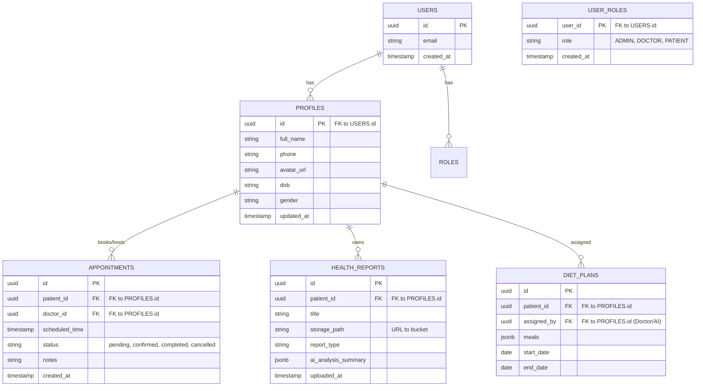

# Database Architecture (Supabase / PostgreSQL)

This document outlines the database schema, security rules, and architectural choices for the Nirogitanman platform.

## ER Diagram

## Tables & Architecture

### 1. `auth.users` (Managed by Supabase)
- Standard Supabase Auth table. Do not query directly from the client; use `profiles`.

### 2. `public.profiles`
- **PK**: `id` (References `auth.users(id)`)
- **Indexes**: `idx_profiles_name`
- **Constraints**: `id` MUST exist in `auth.users`.
- **Soft Delete**: Uses `deleted_at` timestamp.

### 3. `public.user_roles`
- **PK**: `user_id` (References `auth.users(id)`)
- Used to quickly assert RBAC (Role-Based Access Control) across the API and frontend.

### 4. `public.appointments`
- **PK**: `id`
- **FK**: `patient_id` -> `profiles(id)`, `doctor_id` -> `profiles(id)`
- **Constraints**: `scheduled_time` must be in the future during creation.

### 5. `public.health_reports`
- **PK**: `id`
- **FK**: `patient_id` -> `profiles(id)`
- **Columns**: `storage_path` maps directly to Supabase Storage objects. `ai_analysis_summary` holds a summarized version of the report generated by the AI module.

## Row Level Security (RLS) Strategy
RLS is mandatory on ALL public tables. No exceptions.

- **Profiles**:
  - `SELECT`: Users can view their own profile. Doctors can view profiles of their patients.
  - `UPDATE`: Users can update their own profile.
- **Appointments**:
  - `SELECT/INSERT/UPDATE`: Patients can manage their own appointments. Doctors can manage appointments where `doctor_id = auth.uid()`.
- **Health Reports**:
  - `SELECT`: Patients can view their own. Doctors can view reports of patients they have an active appointment with.
  - `INSERT/DELETE`: Only the owning patient or their assigned doctor.

## Storage Buckets
- **avatars**: Public bucket for user profile pictures.
- **health-reports**: Private bucket. Access strictly controlled via Storage RLS (matching `health_reports` table RLS).

## Audit & Timestamp Strategy
- Every table must have `created_at` (default `now()`) and `updated_at`.
- Use Supabase triggers to automatically update `updated_at` on modification.
- Critical tables (like `appointments`) should have an `audit_logs` table (e.g., tracking who cancelled an appointment and when).

## Soft Delete Strategy
- Never physically delete rows from critical tables (`profiles`, `appointments`, `health_reports`). 
- Implement a `deleted_at` timestamp column.
- Update RLS and view queries to automatically append `WHERE deleted_at IS NULL`.
